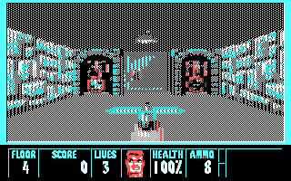
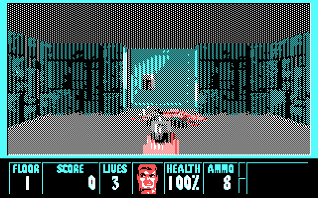
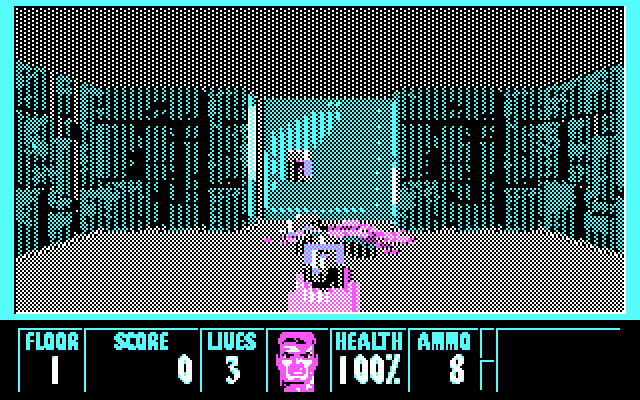
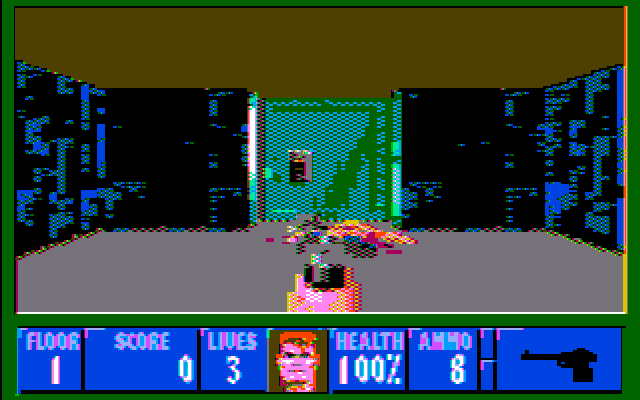
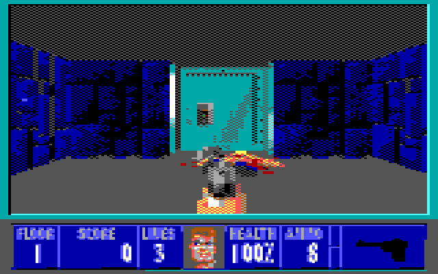
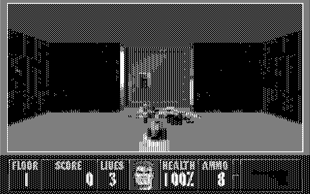
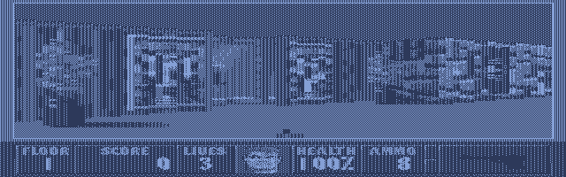

# Wolfenstein 3D CGA

This project is a modification to the original Wolfenstein 3D source release which renders the game in CGA video modes. The engine has also been modified so that it can be run on 8088 based CPUs, allowing it to be run on a wide variety of old PC hardware.

## Supported video modes

### 4 colour RGB mode with red palette

This is the default mode that the game will start in and uses the alternative 'mode 5' black/red/cyan/white palette.

### 4 colour RGB mode with magenta palette

Run the game with the command line `WOLF3DC.EXE classic` to run with the magenta palette 'mode 4' black/magenta/cyan/white palette. This mode avoids directly manipulating CGA registers so may be preferable for clone cards that are do not accurately implement the CGA specification.

### Composite CGA mode

Run the game with the command line `WOLF3DC.EXE composite` to enable the composite colour mode for CGA cards that support NTSC colour output.

### Tandy 160x200 mode

Run the game with the command line `WOLF3DC.EXE tandy` to enable the Tandy 160x200 16 colour mode. This mode has not yet been tested on real hardware and likely has issues with keyboard mapping. Please reach out if you are keen to help test!

### LCD inverse monochrome mode

For machines that feature inverse monochrome LCDs, run with the command line `WOLF3DC.EXE lcd` to run in 640x200 monochrome with the colours inverted. This mode is useful for laptops and palmtops which invert the screen colour.

For devices that feature a wide aspect ratio LCD panel, optionally run with the command line `WOLF3DC.EXE lcd wide` to correct the aspect ratio in the 3D renderer.

## Running Wolfenstein 3D CGA
Check the [releases page](https://github.com/jhhoward/WolfensteinCGA/releases) on Github for prebuilt binaries. A demo based on the shareware release is included in **wolf3dc_shareware.zip** if you don't own a full copy of Wolfenstein 3D.

To play the full, registered version you will need the 1.4 release. This is available to purchase on [Steam.](https://store.steampowered.com/app/2270/Wolfenstein_3D/)
Before you can play in CGA, you will need to convert the original VGA textures, sprites and images. To do this:
1. Unpack the contents of **wolf3dc_registered.zip** into the same folder as your Wolfenstein 3D installation.
2. On a modern Windows machine, run **cgaify.exe** which will read the VGA assets and create new CGA versions.
3. Wolfenstein 3D CGA is now ready to play! Run **WOLF3DC.EXE** on your DOS machine or emulator. See the *Supported video modes* section for launch options.

**NOTE**: The shareware .exe will only work with the shareware files, and the registered .exe will only work with the registered files.

## Extra features
Also included is a benchmarking feature that will play a demo as fast as possible, quit and report the average frames per second. Run with the command line `WOLF3DC.EXE timedemo` to measure the performance on your machine. 

## Building Wolfenstein 3D CGA
To build you will need a copy of the Borland C compiler version 3/3.1. Build the included WOLF3D.PRJ project file with the Borland C IDE. Note that by default the generated executable will only work correctly with a registered version 1.4 copy of Wolfenstein 3D.
